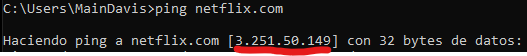
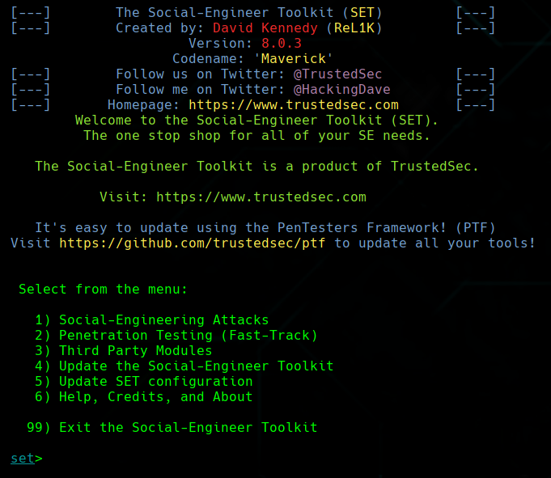
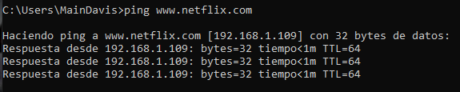

# Practica 5 - Tema 7

## Ejercicio 1

Voy a hacer un ataque de DNS Spoofing para suplantar la dirección IP de netflix por la mía que lleva a un clon malicioso de la misma.

Primero comprobamos en la maquina de la victima y vemos que el ping a la dirección de netflix es correcto.

Ahora toca configurar en la máquina atacante el archivo /etc/ettercap/etter.dns para configurar el DNS spoofing.

Añadimos estas dos lineas:

    www.netflix.com    A   192.168.1.109
    netflix.com        A   192.168.1.109

Siendo 192.168.1.109 la dirección IP de la máquina atacante.

Antes de empezar el ataque, vamos a crear el clon malicioso de netflix y hostearlo en la máquina atacante. Todo esto con la ayuda de la herramienta Setoolkit.

Una vez dentro de la herramienta nos moveremos por el menú:

> **1) Social-Engineering Attacks** > **2) Website Attack Vectors** > **3) Credential Harvester Attack Method** > **2) Site Cloner**

Una vez ahí, insertamos la dirección para el Harvester, siendo en este caso la máquina del atacante, luego insertamos la url de la web a clonar.

Ahora tenemos la web clonada en la máquina atacante y solo tenemos que iniciar el apache.

Una vez tenemos ya la página clonada tenemos todo preparado para realizar el ataque.

Usarmeos el siguiente comando para iniciar el DNS Spoofing:

    ettercap -T -q -i eth0 -P dns_spoof -M ARP ///

Y estaría listo.

En el ordenador de la victima se vería así:

Y haciendo un ping, aparece esto:

## Ejercicio 2

### Red Wi-Fi WEP

WEP (Wired Equivalent Privacy) fue el origen de la encriptación de redes inalámbricas.
Antes de la implementación de WEP, cualquiera podía conectarse a una red inalámbrica y acceder a los datos sin necesidad de una clave.

#### Debilidades WEP

* La longitud de la clave de acceso es fija y debe ser de 10 o 26 caracteres.
* El algoritmo de cifrado es el mismo para todos los usuarios.

### Red Wi-Fi WPA

WPA (Wi-Fi Protected Access) surgió para solucionar los problemas de seguridad que ofrecía el sistema WEP. WPA adopta la autenticación de usuarios mediante el uso de un servidor, donde se almacenan las credenciales y contraseñas de los usuarios de la red.

Y tiene dos tipos:

#### WPA-PSK (Pre-Shared Key)

Se trata del sistema de control de acceso más simple tras WEP y consiste en un sistema de clave
compartida, clave formada entre 8 y 63 caracteres.

##### Debilidades WPA-PSK

* Al basarse en el uso de claves, ésta se puede
identificar por medio del uso de la fuerza bruta.

#### WPA Enterprise

Se trata de un sistema más complejo y funciona mediante el uso de usuario y contraseña o sistemas de
certificados.

### Ataque KRACK

KRACK (Key Reinstallation Attack) es un ataque que se centra en el 4 way handshake que se realiza al iniciar una conexión. En el 4 way handshake se pide una clave de acceso, se la envía al cliente y se le solicita que la vuelva a enviar. El problema es que no se verifica que la clave sea nueva, por lo que se puede reinstalar la clave de acceso en cualquier momento.

Este tipo de ataque funciona en WPA2.
